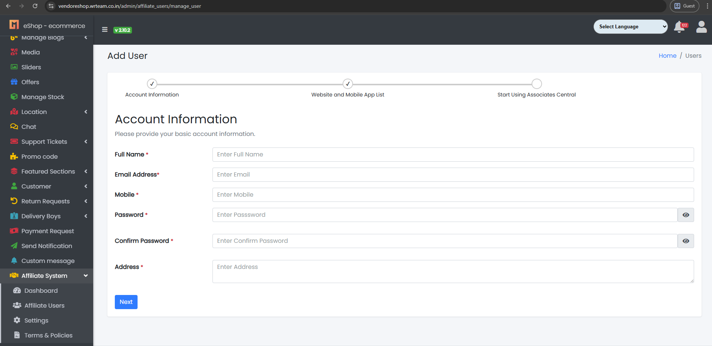
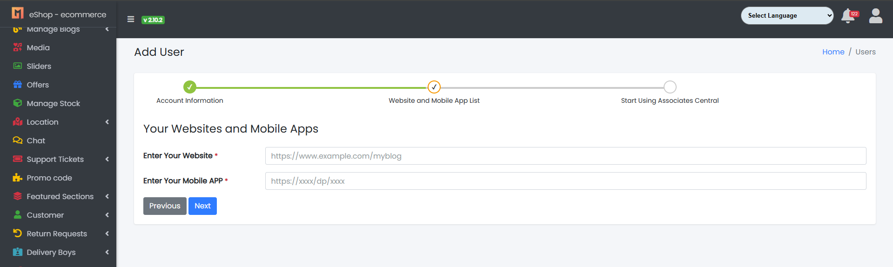

### Add Affiliate User

- The System Tab contains a sub-tab named Affiliate Users.

Sample images

---

- From here, the Affiliate User can be added or updated as per requirements:
    - Full Name: Add the user's full name.
    - Email Address: Add the user's email address.
    - Mobile: Add the user's mobile number.
    - Password: Set a password for the user.
    - Confirm Password: Re-enter the password for confirmation.
    - Website URL: Add the user's website URL.
    - Mobile App URL: Add the user's mobile app URL.