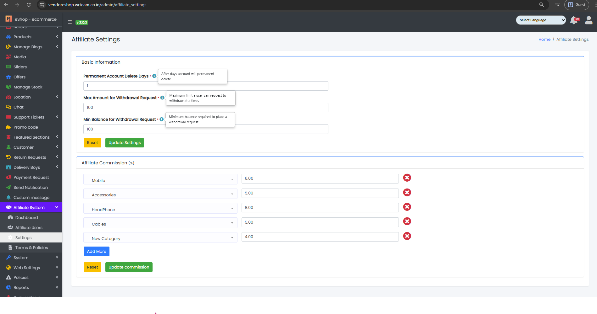

### Affiliate Settings

- The Affiliate System Tab contains a sub-tab named Settings.

Sample image

---

- From here, the Affiliate Settings can be updated as per requirements:
    - Permanent Account Delete Days: Set after how many days an account will be permanently deleted.
    - Max Amount for Withdrawal Request: Set the maximum limit a user can request to withdraw at a time.
    - Min Balance for Withdrawal Request: Set the minimum balance required to place a withdrawal request.
    - Affiliate Commission (%): Set category-wise commission for affiliates.