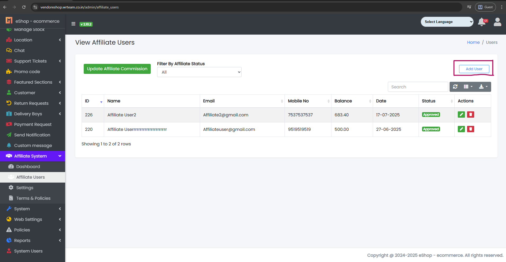

### Affiliate User

- The System Tab contains a sub-tab named Affiliate Users.

Sample image

---

- From here, the Affiliate User can be updated as per requirements:
    - Add User: From here you can add an Affiliate User.
    - Update Affiliate Commission: From here you can update affiliate commissions.