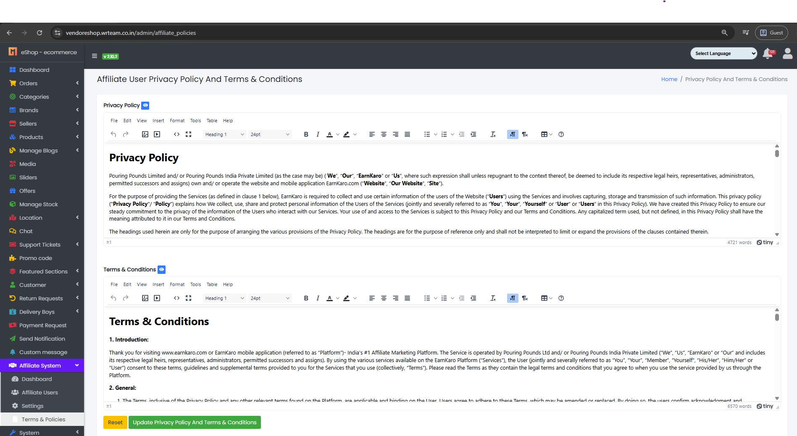

### Affiliate Terms & Policies

- The System Tab contains a sub-tab named Terms & Policies.

Sample image

---

- From here, the admin privacy policy and terms and conditions can be updated as per requirements.
- Click <b>Update Privacy Policy And Terms & Conditions</b> button to update information or <b>Reset</b> to reset the form.