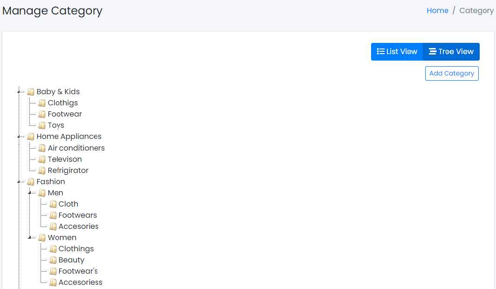
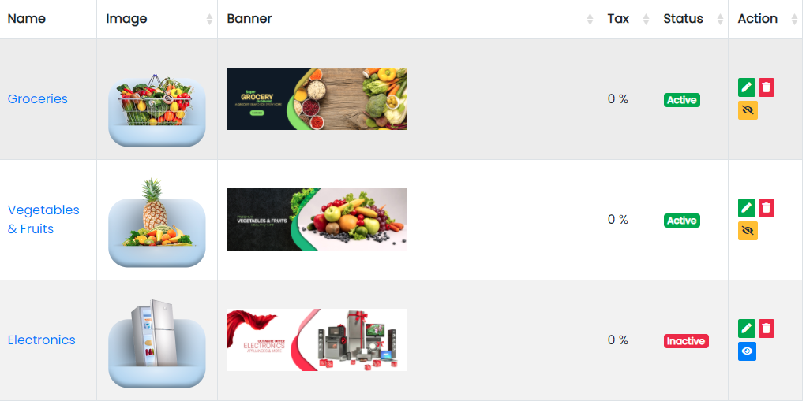

## Categories Panel

Sample image

Here all the information related to Categories is displayed.

### Actions

- **Search Category details**
  - 
    To search the Category Name or any other detail.
- **Refresh Category list**
  - 
    To refresh the Category List.
- **Filters**
  - 
    Used to filter the Category details according to the criteria.
- **Edit Category**
  - 
    Used to edit the Category details.
- **Delete Category**
  - 
    Used to delete the Category details.
- **Category Status**
  - 
    Used to activate and deactivate the Category Status.

---

Here all the information related to Categories is displayed on Tree View.

---

We can add new categories and delete categories by following steps:

### Step 1: Adding New Category in the Category List

Click on Add Category Tab present on the right side.

Sample image

After clicking the New Category tab, a new window will be displayed as follows:

Sample image

Steps:
1. In **Category Name** field, enter the name of the Category.
2. In **Category Tax** field, enter the tax in Percentage (%) of the Category.
3. To know how to upload an image in the form, click [here](#add-image-form).
4. Click **Add Category** to add the Category or **Reset** to reset the form.

The Category added successfully.

---

### Step 2: Delete Category from the List

For deleting a category, use  as explained above under Actions category.

---

## Product Panel

The Products Tab contains sub-tabs like Add Products, Attributes, Attribute Sets, Attribute Values, Tax, Manage Products, and Products Order.

Sample image
