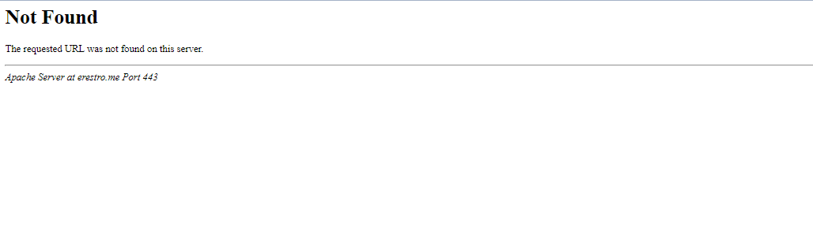
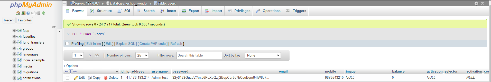
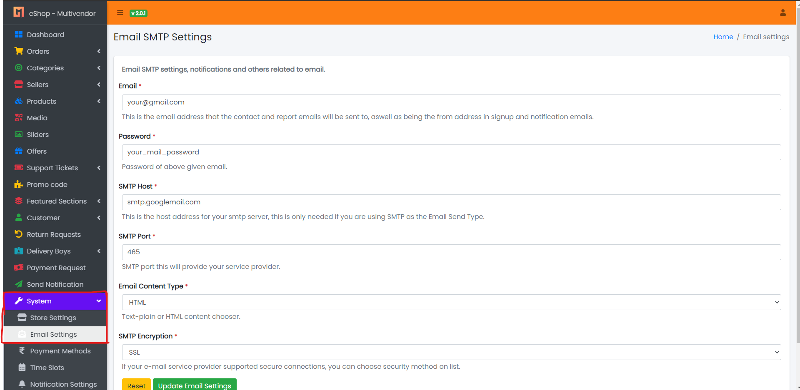
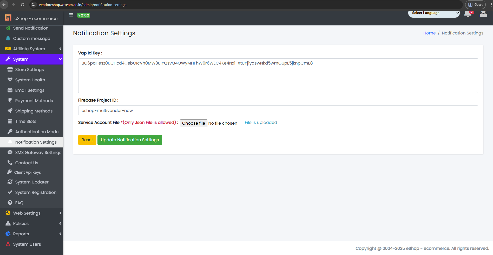
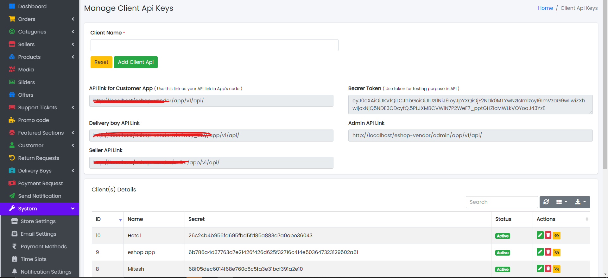

# Common Issues (Server Specific)

---

## 404 Code Found?



1. Your **.htaccess** file is missing from your server.
2. To resolve this, open the zip file you downloaded from CodeCanyon.
3. Unzip the file: **Code vX.X - upload this to server**
4. Open that folder and you will find the **.htaccess** file.
5. Upload that file to the main folder.

---

## Not Settling Payments to Sellers While Delivering the Order?

1. Check that you have set the **Cron job** on your server.
2. Note: If you are not aware of cron jobs, you can ask your server provider for help or documentation.
3. For more details on the commission method, you will find guidance at the bottom of the System -> System Settings page.
4. The cron job automates payment settlements. If you want to do it manually, there is an option for that too.
5. Go to Sellers -> Sellers Menu.
6. Click on **Update Seller Commission** button for settlement of seller payments.  
   

---

## Assign Categories to Seller

<video width="500" height="300" controls>
  <source src="../../static/backend/videos/assign_category.webm" type="video/mp4"></source>
</video>

---

## Added Product But Not Showing?

1. If the seller added the product, the admin needs to activate it.
2. Check your **only_full_group_by_mode** on your server. It must be disabled.
3. If you are having this **only_full_group_by_mode** issue, it is a server-side issue. Please ask your server support to disable **only_full_group_by_mode** in PHPMyAdmin (MySQL).
4. Check if the product is active or inactive. It must be active to display.

---

## Not Installing?


1. Fill in all the fields; do not leave any blank.
2. Use the same mobile, password, and email for the installation. You can change the password from the profile section.
3. To change the mobile number, you need to run a query in your MySQL (PhpMyAdmin).

   **Steps to run this query:**
   1. Open PhpMyAdmin on your server and select your database and table.  
      
   2. Open the Users table.
   3. Click on the SQL tab.  
      
   4. Copy and paste the following query in the SQL tab page:
      ```sql
      UPDATE `users` SET `mobile` = 'YOUR_MOBILE_NUMBER' WHERE `users`.`id` = 1;
      ```
   5. Click on the **GO** button to run the query.  
      

---

## SMTP Email Notification Not Working?

1. You must set up the email settings on the panel. See the image below:  
   
2. You can test your SMTP configuration here: [https://www.gmass.co/smtp-test](https://www.gmass.co/smtp-test)

---

## Push Notification Not Working?

1. Set up the FCM Server Key.  
   
2. If it is still not working, log out of the app, then log in again and check the notification.

---

## Invalid Hash Error?

1. Check that you have created the Client API Keys for your application.  
   
2. Set that secret key on the application side.
3. It should match on both the application and Admin panel sides.