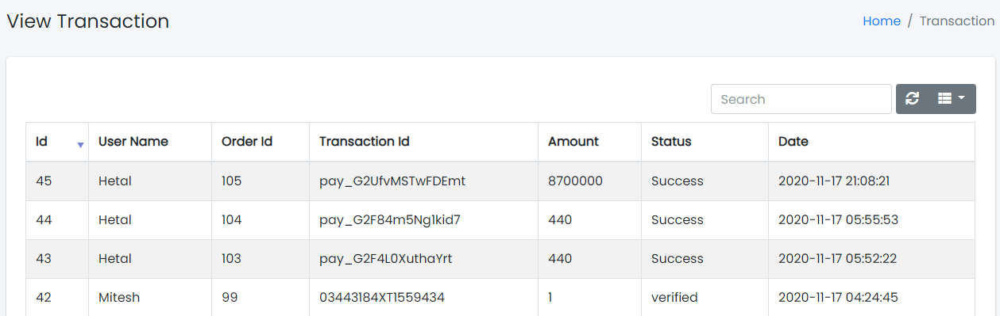

## View Transaction

Sample image

Here all the information related to Customer Transaction is displayed.

---

#### Actions

- **Search Customer Transaction**
  - 
    To search the Customer Name or any other detail.
- **Refresh Customer Transaction list**
  - 
    To refresh Customer Transaction List.
- **Filters**
  - 
    Used to filter the Customer Transaction details according to the criteria.