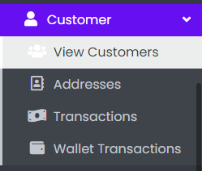
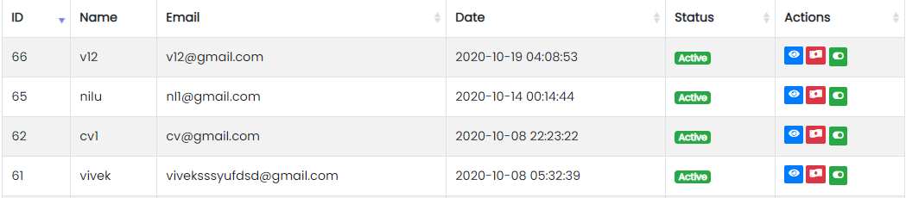

### Customer Panel

- The Customer Tab contains sub-tabs like View Customers, Transaction, and Wallet Transaction.

Sample image

---

## View Customer

Sample image

Here all the information related to Customer is displayed.

---

#### Actions

- **Search Customer**
  - 
    To search the Customer Name or any other detail.
- **Refresh Customer list**
  - 
    To refresh Customer List.
- **Filters**
  - 
    Used to filter the Customer details according to the criteria.