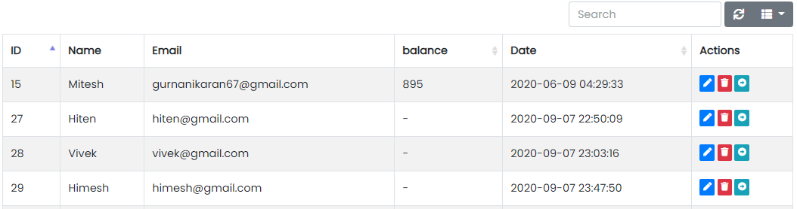

### Delivery Boys Panel

- The Delivery Boys Tab contains sub-tabs like Manage Delivery Boys and Fund Transfer.

Sample image

---

### Manage Delivery Boys

Sample image

Here all the information related to Delivery Boys is displayed.

---

#### Actions

- **Search Delivery Boys details**
  - 
    To search the Delivery Boys related detail.
- **Refresh Delivery Boys list**
  - 
    To refresh Delivery Boys list.
- **Filters**
  - 
    Used to filter the Delivery Boys details according to the criteria.
- **Edit Delivery Boys Values**
  - 
    Used to edit the Delivery Boys values details.
- **Delete Delivery Boys**
  - 
    Used to delete the Delivery Boys details.
- **View Fund Transfer values**
  - 
    Used to view fund transfer details.

---

We can add new Delivery Boys and delete Delivery Boys by following steps:

---

### Step 1: Adding New Delivery Boys in the Delivery Boys List

Sample image

Steps:
1. In **Name** field, enter the name of the Delivery Boys.
2. In **Mobile** field, enter the mobile number of the Delivery Boys.
3. In **Email** field, enter the email of the Delivery Boys.
4. In **Password** field, enter the password.
5. In **Confirm Password** field, enter the confirm password.
6. In **Address** field, enter the address of the Delivery Boys.
7. In **Bonus** field, enter the bonus.
8. Click **Add Delivery Boy** to add Delivery Boy or **Reset** to reset the form.

---

### Step 2: Delete Delivery Boy from the List

For deleting Delivery Boy, use  as explained above under Actions Delivery Boy.