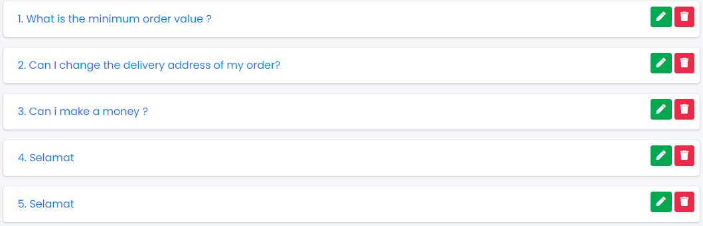
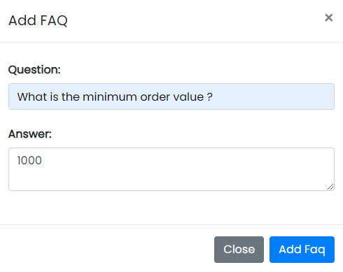

# FAQ

Sample Image

In this panel, all the questions are displayed which are asked by the users.

Actions:

- **Edit Faq**

    Used to edit the Category details.
- **Delete Faq**
  
    Used to delete the Category details.

<!-- <ul  class="text-success">
  <li>
    Edit
    <ul>
      <li></img> Used to edit the answers.</li>
    </ul>
  </li>
  <li>
    Delete
    <ul>
      <li></img> Used to delete the questions.</li>
    </ul>
  </li>
</ul> -->

---

## Adding New FAQ

Sample image

Steps:
1. In **Question** field, enter the question.
2. In **Answer** field, enter the answer.
3. Click **Add FAQ** to add FAQ or **Close** to close the form.