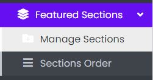

### Featured Sections Panel

- The Featured Sections Tab contains sub-tabs like Manage Sections and Sections Order.

Sample image

---

### Manage Sections

Sample image

Here all the information related to Featured Sections is displayed.

---

#### Actions

- **Search Featured Sections details**
  - 
    To search the Featured Sections related detail.
- **Refresh Featured Sections list**
  - 
    To refresh Featured Sections list.
- **Filters**
  - 
    Used to filter the Featured Sections details according to the criteria.
- **Edit Featured Sections Values**
  - 
    Used to edit the Featured Sections values details.
- **Delete Featured Sections**
  - 
    Used to delete the Featured Sections details.

---

We can add new Featured Sections and delete Featured Sections by following steps:

---

### Step 1: Adding New Featured Sections in the Featured Sections List

Sample image

Steps:
1. In **Title For Section** field, enter the title of the Sections list.
2. In **Short Description** field, enter the description of the Featured Sections list.
3. Select **Style** field of the Featured Sections list.
4. In **Products** field, enter the products of the Featured Sections list.
5. Click **Add Featured Sections** to add Featured Sections or **Reset** to reset the form.

---

### Step 2: Delete Featured Sections from the List

For deleting Featured Sections, use  as explained above under Actions Featured Sections.
