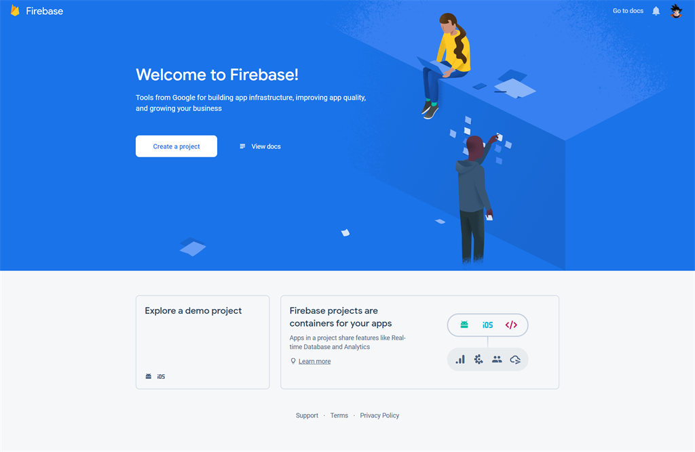

### Configure the Firebase Setup for Web Version Login

> **Note:**  
> This step is very important for the web version's login, register, and forget password features to work. Please follow the steps below carefully.

---

#### 1. Create Firebase Project

A. Go to the [Firebase Console](https://console.firebase.google.com/).

B. Register a new account or log in with an existing Google account.

Sample image

C. Once logged in, you will see the Firebase Console dashboard. Click on **Add Project**.  
   - Provide a project name, select country, and then click on **Create Project**.  
   - For example, see the images below:

Sample image

Sample image

D. Once the project has been created, it will automatically redirect to the Firebase dashboard screen.

Sample image

E. As eShop Front End (Web version) is a web project, you need to add a web application to the Firebase project.

Sample image

F. Go to **Authentication** and open the **Sign-in method** tab.

Sample image

G. At the bottom of the page:  
   - In "Authorized domains", `localhost` and a Firebase domain are automatically added.  
   - You must add your domain name (without `http://` or `https://`) where the eShop Front End (Web Version) website will be hosted.  
   - If you're using `www` as a prefix, you must add both with and without `www`.

H. Add your domain with **www** as prefix, e.g., `www.myeShop.com`.

I. Also add your domain without **www**, e.g., `myeShop.com`.

Sample image

J. Go to **Project settings** in the Firebase dashboard.

Sample image

K. In **Project settings**, scroll down to find the created web app; there you will find the config option containing the Firebase settings for the frontend.

L. Set all details except the two fields:  
   - `databaseURL`  
   - `measurementId`  
   For these two fields, you can set the value as **test**.

Sample image

M. Set these details in the eShop admin panel under **Web Settings**, using the Project settings from the Firebase dashboard.

Sample image

