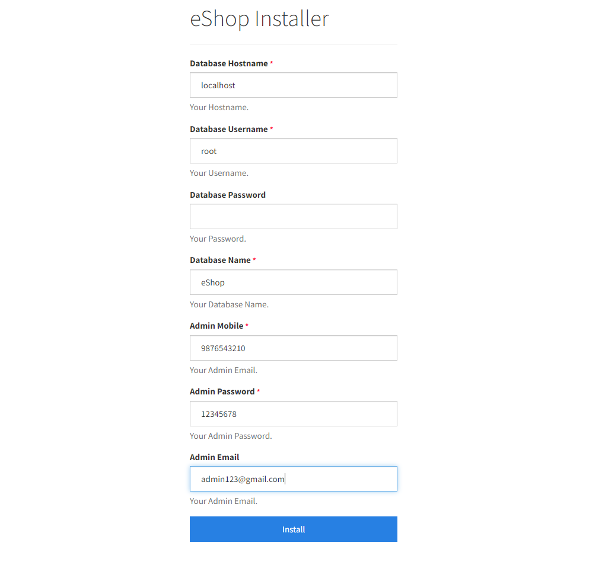

### Step 1. How to Install the eShop Backend and/or Web Version Code on Your Server Using the Installation Wizard

1. **Upload the Code**  
   First, find the **eShop** folder inside the PHP code folder from the downloaded package and upload the code to your server on your desired domain or subdomain.  
   **Example:** If you have the domain `https://eshop.com`, upload it there.

2. **Create a New Database**  
   Use cPanel to create a new database.

3. **Create a Database User**  
   Create a new user for the database and grant all privileges to this user.

4. **Start the Installation Wizard**  
   After creating the user, visit: `https://eshop.com/install`

   
   
Sample image

5. **Fill in Installation Details:**
   1. **Database Hostname:** Enter the hostname.
   2. **Database Username:** Enter the username that has access to the database.
   3. **Database Password:** Enter the password.
   4. **Database Name:** Enter the name of the database.
   5. **Admin Mobile:** Enter the mobile number (**This mobile number will be used further for user authentication**)
   6. **Admin Password:** Enter the password (**This password will be used further for user authentication**)

6. **Complete Installation**  
   Now click **Install**. That's it! You are ready to run your first eCommerce app: **https://eshop.com/**