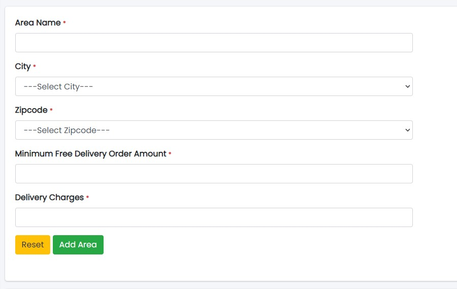

### Areas

Sample Image

#### Actions:

- **Search**
  - 
    This feature is used to search areas according to city's name.
- **Refresh Area list**
  - 
    To refresh Area list.
- **Filters**
  - 
    Used to filter the Area details according to the criteria.
- **Edit**
  - 
    Used to edit the Area details.
- **Delete**
  - 
    Used to delete the specific Area.

---

## Adding New Areas

Sample Image

Steps:
1. In **Area Name** field, enter the area name.
2. In **City** field, select the city.
3. Click **Add Area** to add the area or **Reset** to reset the form.