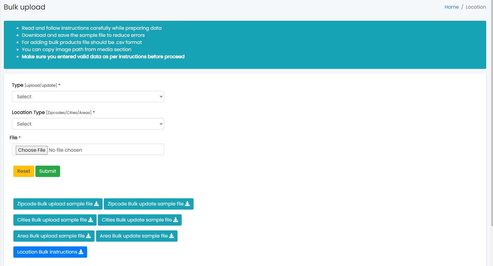

### Bulk Upload

Sample Image

Steps:
1. Select <b>Type [upload/update]</b> you want to upload.
2. Select <b>Location Type [Zipcodes/Cities/Areas]</b> you want to upload.
3. Select CSV file you want to upload.
4. Click <b>Submit</b> to upload or <b>Reset</b> to reset the form.
5. Read instructions and download sample files for more understanding.