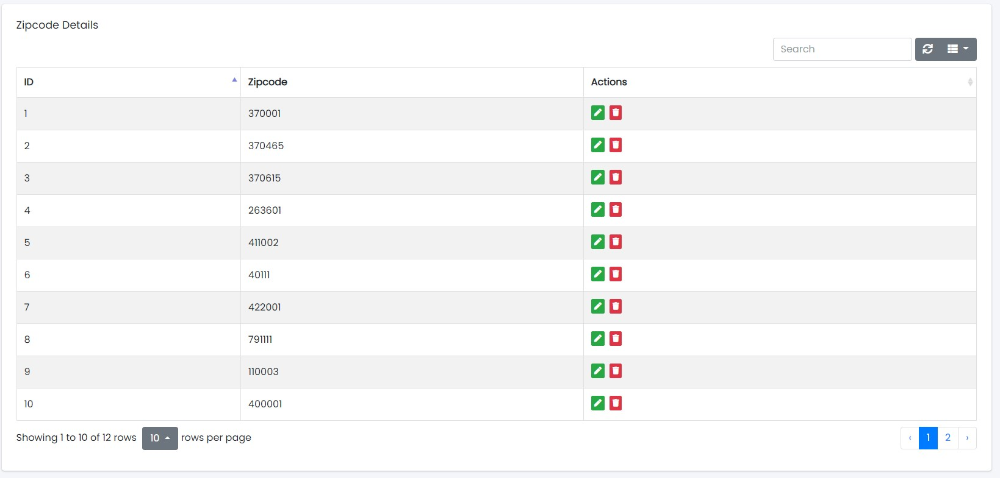
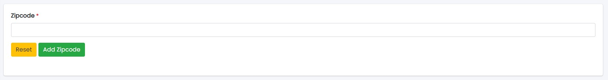

### Location

- The Location Tab contains four sub-tabs:
  1. Zipcodes
  2. City
  3. Areas
  4. Bulk Upload

Sample Image

---

### Zipcodes

Sample Image

#### Actions:

- **Search Zipcode**
  - 
    Used to search the specific Zipcode.
- **Refresh Zipcode list**
  - 
    To refresh Zipcode list.
- **Filters**
  - 
    Used to filter the Zipcode details according to the criteria.
- **Edit**
  - 
    Used to edit the Zipcode details.
- **Delete**
  - 
    Used to delete the specific Zipcode.

---

## Adding New Zipcode

Sample Image

Steps:
1. In **Zipcode** field, enter the name of the Zipcode.
2. Click **Add Zipcode** button to add the Zipcode or **Reset** to reset the form.