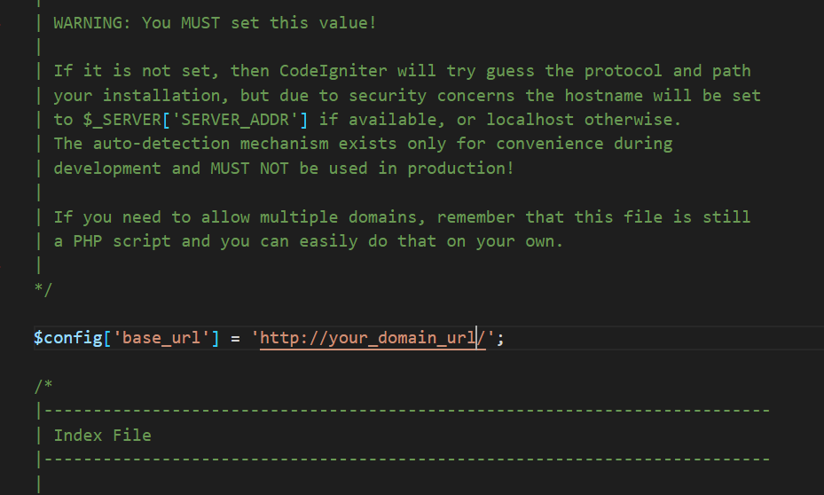

### How to Install the eShop Backend and/or Web Version Code on Your Server Manually

1. **Edit the Config File**  
   Open `application/config/config.php` on your server.

2. **Set Your Domain URL**  
   Set your domain URL in `base_url`.  
   Example:  
   ```php
   $config['base_url'] = 'http://your_domain_url/';
   ```
   

3. **Edit the Database Configuration**  
   Open `application/config/database.php` on your server.

4. **Set Database Credentials**  
   Set your database username, password, and database name in this file.

5. **Import the Blank Database**  
   Import the blank database into your phpMyAdmin.  
   *(You will find the blank database in your code package, e.g., `eShop Multi Vendor - blank database - vx.x.x`)*  
   

6. **Delete the Install Folder**  
   Open the code on your server and delete the `install` folder.

7. **System Ready**  
   Your system is now ready to use.

8. **Default Login Credentials**  
   You can log in using:  
   - **Mobile:** `9876543210`  
   - **Password:** `12345678`