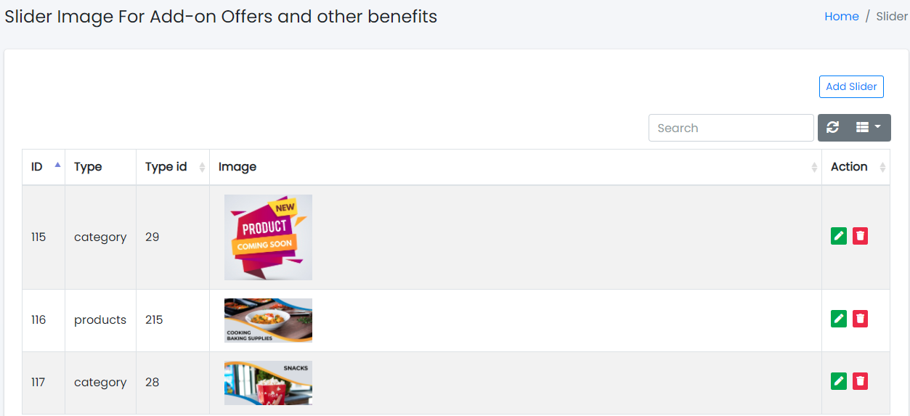

### Home Slider Images

Sample image

Here all the information related to Home Slider Images is displayed.

---

#### Actions

- **Search slider image details**
  - 
    To search the slider related details.
- **Refresh slider list**
  - 
    To refresh the slider list.
- **Filters**
  - 
    Used to filter the slider details according to the criteria.
- **Edit slider**
  - 
    Used to edit the slider image.
- **Delete slider**
  - 
    Used to delete the slider image.

---

We can add new Slider and delete Slider by following steps:

---

### Step 1: Adding New Slider in the Home Image Slider

Click on Add Slider Tab present on the right side.

Sample image

Clicking the Add Slider tab will display a new window as follows:

Sample image

Steps:
1. In **Type** field, enter the type of the Slider Images list.
2. To know how to upload an image in the form, click [here](#add-image-form).
3. Click **Add Slider** to add Slider or **Reset** to reset the form.

---

### Step 2: Delete Slider from the List

For deleting Slider Images, use  as explained above under Actions Slider Images.