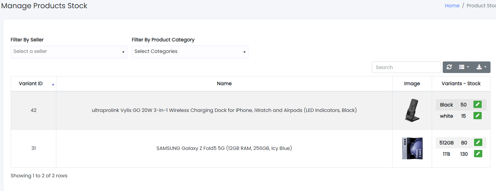
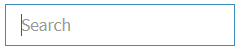
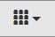
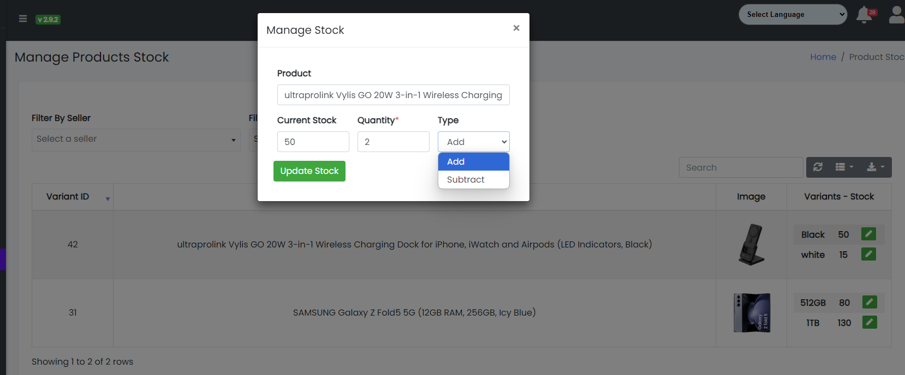

### Manage Stock

Sample image

Here all the information related to Manage Stock is displayed.

---

#### Actions

- **Search Product details**
  - 
    To search the stock product related detail.
- **Refresh Product list**
  - 
    To refresh stock product list.
- **Filters**
  - 
    Used to filter the stock product details according to the criteria.
- **Edit Product Stock Values**
  - 
  - 
    Used to edit the stock product values details (add or subtract stock of product).