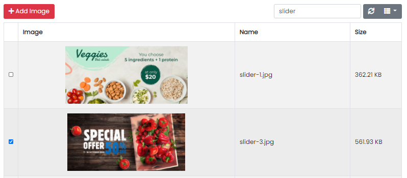

### Media Management

Here all types of images/documents can be uploaded.

Here all types of images/documents can be viewed.

- </img> Used to delete the image.
- </img> Used to copy the image path to clipboard.

---

### How to add image in a form

- </img>: This button will appear in forms where image is required.
- After clicking on upload button, the following dialog box will open:

Image upload dialog

- Now select an image and click on Add Image button.

Image selected for upload

- Image will be added as seen below:

Image successfully added

- That's all. You have successfully added image in the form.