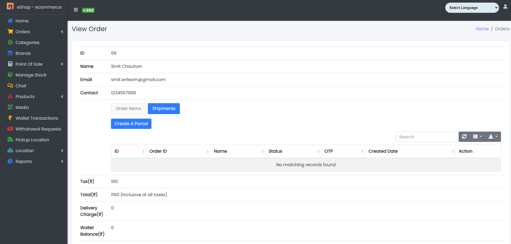
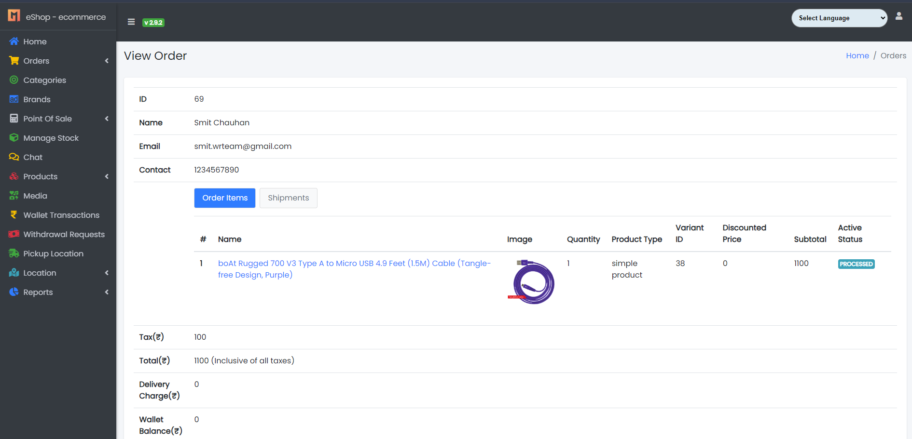
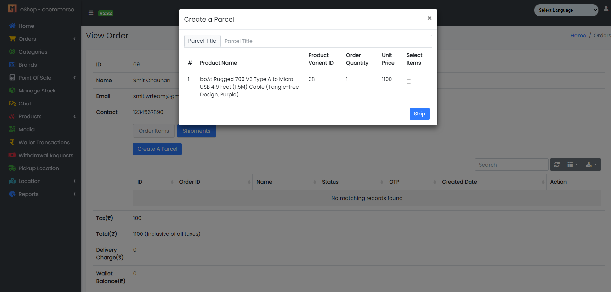
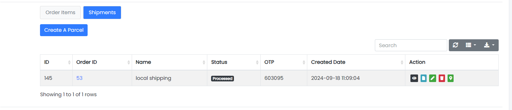
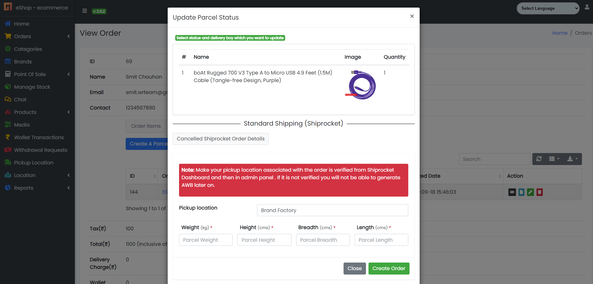
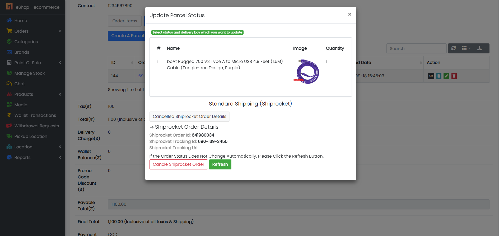
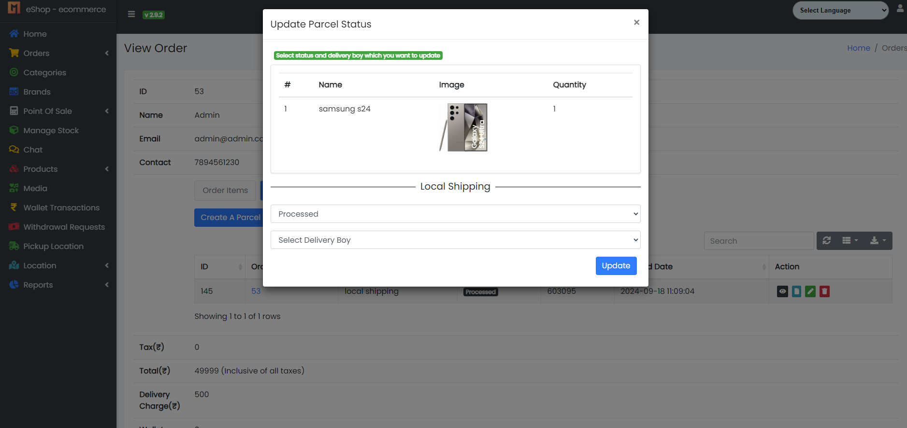
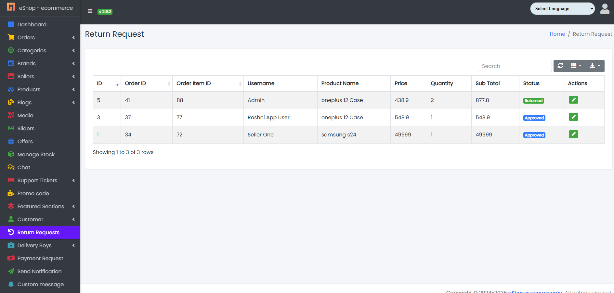
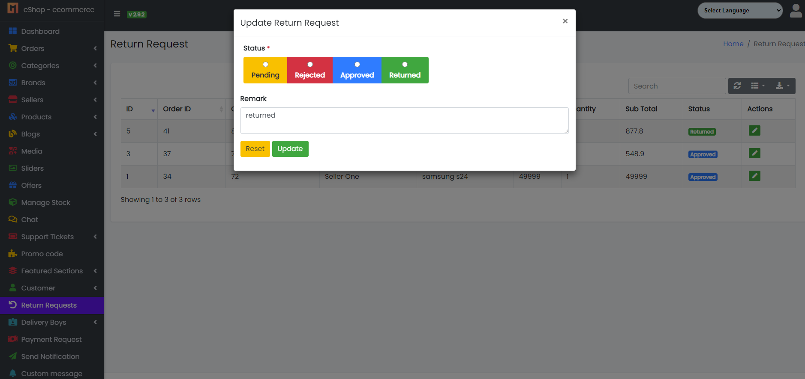

### 1. Seller Panel Overview

- In the Seller Panel, you’ll notice two tabs: **Order Items** and **Shipments**.
  - In the **Order Items** tab, you’ll see all the items for your orders.
  - In the **Shipments** tab, you’ll find a "Create a Parcel" button and the **Created Parcels List**.

---

### 2. Creating a Parcel

To ship an order, click on the **Create a Parcel** button. You’ll be able to select the items you want to ship and then create the parcel.

---

### 3. Managing Parcels

Once a parcel is created, it will appear in a list with four action buttons:
- **View:** See the items inside the parcel.
- **Invoice:** View or download the invoice for the parcel.
- **Update Status:** Open a window to update the shipping status.
- **Delete:** You can delete a parcel, but only if it hasn't been shipped yet.

---

### 4. Updating Shipping Status

When you click **Update Status**, a window will open with two options:
- **Local Shipping:** Select the delivery person and update the status.
- **Shiprocket Orders:** First, create a Shiprocket parcel with the required details. Once created, Shiprocket parcel details will appear in the status update tab. Below this, you’ll see two buttons:
  - **Cancel Shiprocket Parcel:** Lets you cancel the Shiprocket parcel if needed.
  - **Refresh:** Refresh the status if it doesn't update automatically.

  > _Note: The status will usually update on its own, but clicking "Refresh" will manually update it to reflect the current parcel status._

---

### 5. Return Process

The return process remains the same as before:
- Currently, the method for managing return parcels is manual.
- When a customer requests a return, the admin will receive the request, accept it, and mark the item as returned once the parcel is received.
- **Note:** Sellers cannot update the status for returns.

