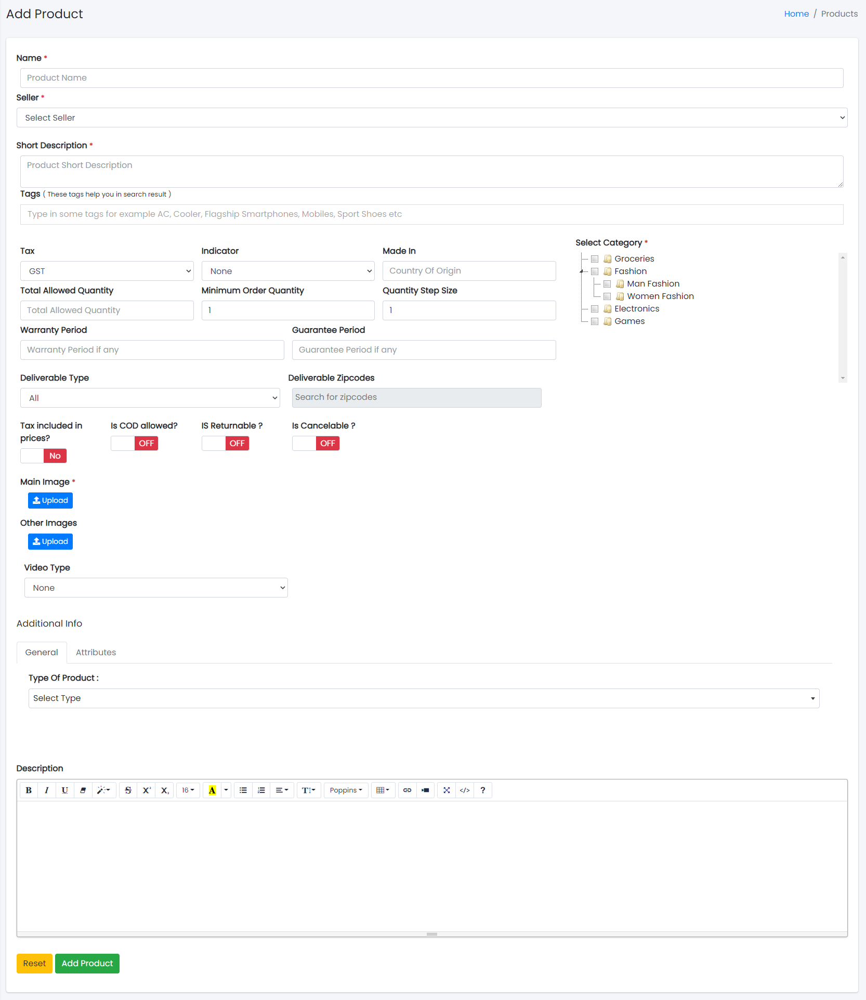

### Add Product

#### Adding New Product in the Product List

##### Reference Videos for Adding Products:
1. [Assign Category To Seller](https://drive.google.com/file/d/1CxXLYpIyX82K0ftompMPbrZAEg9VE_ZU/view?usp=drive_link)
2. [Add Variable Product](https://drive.google.com/file/d/1c5iAaOQcyuXj1ND1u6KeCgL8Gc6Z7Ns8/view?usp=drive_link)
3. [Simple Product Stock](https://drive.google.com/file/d/1J1b-c2UwtMidIsYglrsyQ0MdI35PhANu/view?usp=drive_link)
4. [Variable Product Stock Product Level](https://drive.google.com/file/d/1ecpu4vuFoWU0JdKp2vOOoRfVHVJrMzYk/view?usp=drive_link)
5. [Variable Product Stock Variant Level](https://drive.google.com/file/d/1fRXERRRlDDVsFzn9Aaa8NYbq5trsGkH9/view?usp=drive_link)

---

- Clicking the New Product tab will display a new window as follows:

Sample image

**Steps:**
1. In **Product Name** field, enter the name of the product.
2. In **Product Description** field, enter the description of the product.
3. In **Tax** field, enter the tax for the product.
4. Select the **Indicator** (e.g., Veg & Non-veg type) of the product.
5. In **Made In** field, enter the country of origin of the product.
6. Select the **Category** of the product.
7. To know how to upload an image in the form, click [here](#add-image-form).
8. Click **Add Product** to add the product or **Reset** to reset the form.