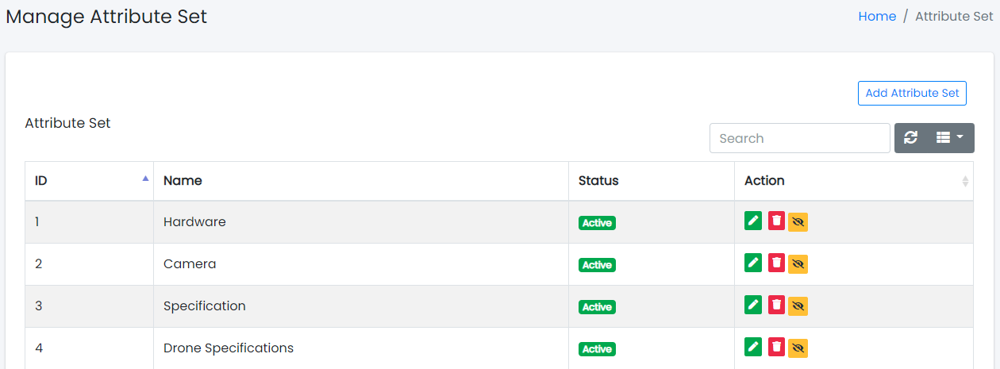
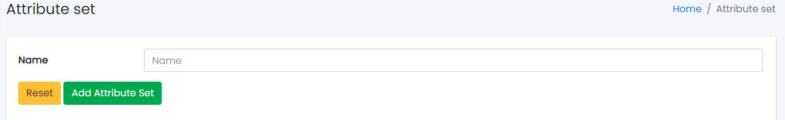

### Attribute Sets

Sample image

Here all the information related to Attribute Sets is displayed.

---

#### Actions

- **Search Attribute Sets details**
  - 
    To search the Attribute Sets Name or any other detail.
- **Refresh Attribute Sets list**
  - 
    To refresh the Attribute Sets List.
- **Filters**
  - 
    Used to filter the Attribute Sets details according to the criteria.
- **Edit Attribute Sets**
  - 
    Used to edit the Attribute Sets details.
- **Delete Attribute Sets**
  - 
    Used to delete the Attribute Sets details.
- **Attribute Sets Status**
  - 
    Used to activate and deactivate the Attribute Sets Status.

---

We can add new Attribute Sets and delete Attribute Sets by following steps:

---

### Step 1: Adding New Attribute Sets in the Attribute Sets List

Click on Add Attribute Sets Tab present on the right side.

Sample image

Clicking the Add Attribute Sets tab will display a new window as follows:

Sample image

Steps:
1. In **Attribute Sets Name** field, enter the name of the Attribute Sets.
2. Click **Add Attribute Sets** to add Attribute Sets or **Reset** to reset the form.

---

### Step 2: Delete Attribute Sets from the List

For deleting Attribute Sets, use  as explained above under Actions Attribute Sets.