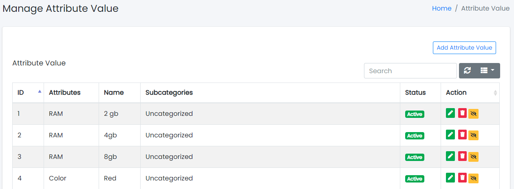
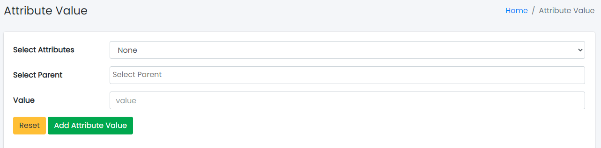
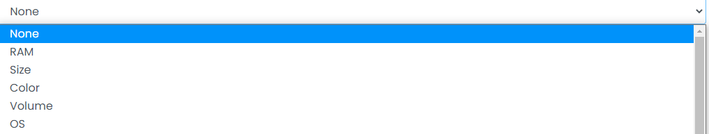

### Attribute Values

Sample image

Here all the information related to Attribute Values is displayed.

---

#### Actions

- **Search Attribute Values details**
  - 
    To search the Attribute Values Name or any other detail.
- **Refresh Attribute Values list**
  - 
    To refresh the Attribute Values List.
- **Filters**
  - 
    Used to filter the Attribute Values details according to the criteria.
- **Edit Attribute Values**
  - 
    Used to edit the Attribute Values details.
- **Delete Attribute Values**
  - 
    Used to delete the Attribute Values details.
- **Attribute Values Status**
  - 
    Used to activate and deactivate the Attribute Values Status.

---

We can add new Attribute Values and delete Attribute Values by following steps:

---

### Step 1: Adding New Attribute Values in the Attribute Values List

Click on Add Attribute Values Tab present on the right side.

Sample image

Clicking the Add Attribute Values tab will display a new window as follows:

Sample image

Steps:
1. Select the **Attribute Values**.
   
2. Select the **Parent**.
   
3. Click **Add Attribute Values** to add Attribute Values or **Reset** to reset the form.

---

### Step 2: Delete Attribute Values from the List

For deleting Attribute Values, use  as explained above under Actions Attribute Values.