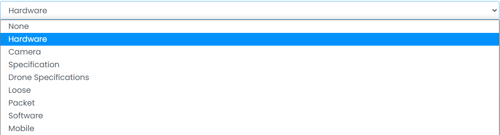

### Attributes

Sample image

Here all the information related to Attributes is displayed.

---

#### Actions

- **Search Attributes details**
  - 
    To search the Attributes Name or any other detail.
- **Refresh Attributes list**
  - 
    To refresh the Attributes List.
- **Filters**
  - 
    Used to filter the Attributes details according to the criteria.
- **Edit Attributes**
  - 
    Used to edit the Attributes details.
- **Delete Attributes**
  - 
    Used to delete the Attributes details.
- **Attributes Status**
  - 
    Used to activate and deactivate the Attributes Status.

---

We can add new Attributes and delete Attributes by following steps:

---

### Step 1: Adding New Attributes in the Attributes List

Click on Add New Attributes Tab present on the right side.

Sample image

After clicking the New Attributes tab, a new window will be displayed as follows:

Sample image

Steps:
1. Select **Attributes Set** field of the Attributes.
   
2. In **Name** field, enter the name of the Attributes.
3. Click **Add Attributes** to add Attributes or **Reset** to reset the form.

---

### Step 2: Delete Attributes from the List

For deleting Attributes, use  as explained above under Actions Attributes.