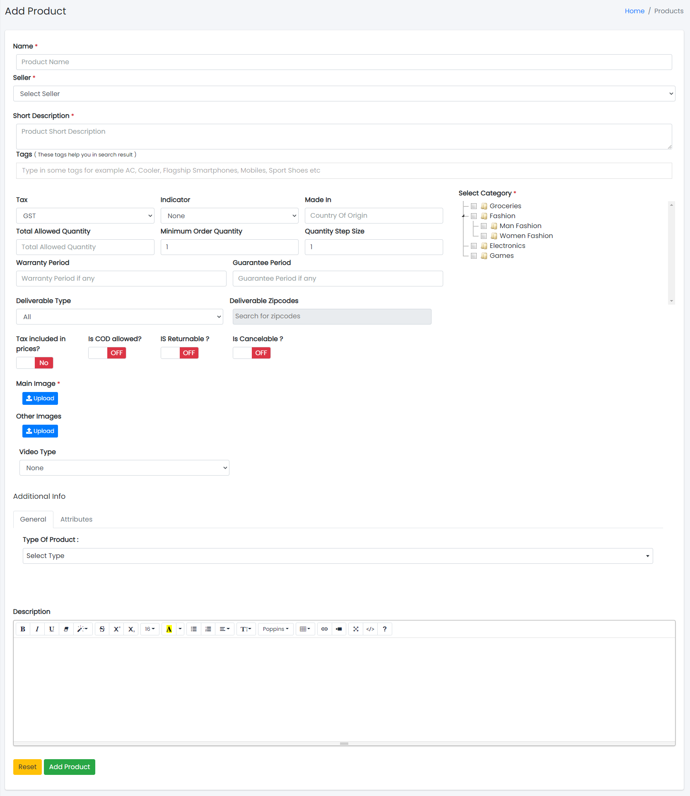

### Manage Products

Sample image

Here all the information related to Products is displayed.

---

#### Actions

- **Search the Products details**
  - 
    To search the Products Name or any other detail.
- **Refresh Manage Products list**
  - 
    To refresh Products List.
- **Filters**
  - 
    Used to filter the Products details according to the criteria.
- **Edit the Products**
  - 
    Used to edit the Products details.
- **Delete the Products**
  - 
    Used to delete the Products details.

---

We can add new Products and delete Products by following steps:

---

### Step 1: Adding New Products in the Products List

Click on Add Products Tab present on the right side.

Sample image

Clicking the Add Products tab will display a new window as follows:

Sample image

Steps:
1. In **Product Name** field, enter the name of the Product.
2. In **Product Description** field, enter the description of the Product.
3. In **Tax** field, enter the tax of the Product.
4. Select the **Indicator** (like Veg & Non-veg Type) of the Product.
5. In **Made In** field, enter the country of origin of the Product.
6. Select the **Category** of the Products.
7. To know how to upload an image in the form, click [here](#add-image-form).
8. Click **Add Product** to add product or **Reset** to reset the form.

---

### Step 2: Delete Products from the List

For deleting Products, use  as explained above under Actions Products.