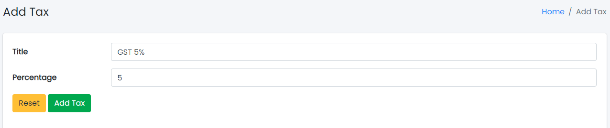

### Products Tax

Sample image

Here all the information related to Products Tax is displayed.

---

#### Actions

- **Search Products Tax details**
  - 
    To search the Products Tax title or any other detail.
- **Refresh Products Tax list**
  - 
    To refresh the Products Tax List.
- **Filters**
  - 
    Used to filter the Products Tax details according to the criteria.
- **Edit Products Tax**
  - 
    Used to edit the Products Tax details.
- **Delete Products Tax**
  - 
    Used to delete the Products Tax details.

---

We can add new Products Tax and delete Products Tax by following steps:

---

### Step 1: Adding New Tax in the Products Tax List

Click on Add Tax Tab present on the right side.

Sample image

Clicking the Add Products Tax tab will display a new window as follows:

Sample image

Steps:
1. In **Products Tax Title** field, enter the title of the Products Tax.
2. Click **Add Tax** to add Tax or **Reset** to reset the form.

---

### Step 2: Delete Products Tax from the List

For deleting Products Tax, use  as explained above under Actions Products Tax.