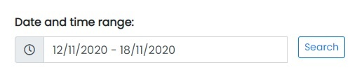
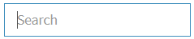

# Reports

- The Report Tab contains sub-tabs:
  1. Sales Report

Sample Image

---

# Sales Report

Sample Image

### Actions:

- **Search Sales Report**
  - 
    This feature is used to search Sales report data between dates specified by the user.

- **Search Sales Report Data**
  - 
    This feature is used to search Sales report data.

- **Refresh Sales Report list**
  - 
    To refresh Sales Report list.

- **Filters**
  - 
    Used to filter the Sales Report details according to the criteria.