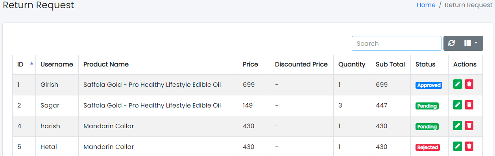
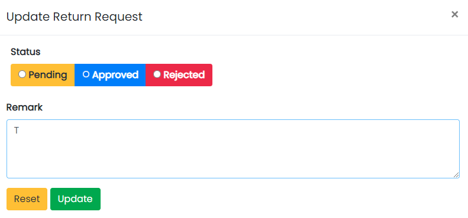

### Return Requests

Sample image

Here all the information related to Return Requests is displayed.

---

#### Actions

- **Search Return Requests details**
  - 
    To search the Return Requests related detail.
- **Refresh Return Requests list**
  - 
    To refresh Return Requests list.
- **Filters**
  - 
    Used to filter the Return Requests details according to the criteria.
- **Edit Return Requests Values**
  - 
    Used to edit the Return Requests values details.
- **Delete Return Requests**
  - 
    Used to delete the Return Requests details.

---

We can edit Return Requests and delete Return Requests by following steps:

---

### Step 1: Edit Return Requests in the Return Requests List

Sample image

Steps:
1. Select **Status** field of the Return Requests list.
2. In **Remark** field, enter the remark of the Return Requests list.
3. Click **Update** to update Return Requests or **Reset** to reset the form.

---

### Step 2: Delete Return Requests from the List

For deleting Return Requests, use  as explained above under Actions Return Requests.