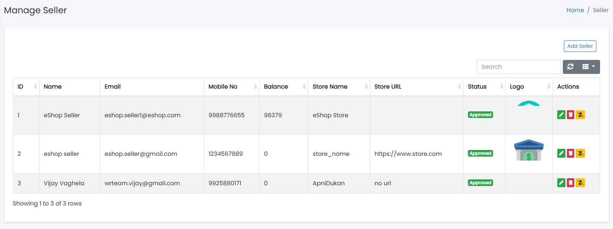
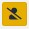
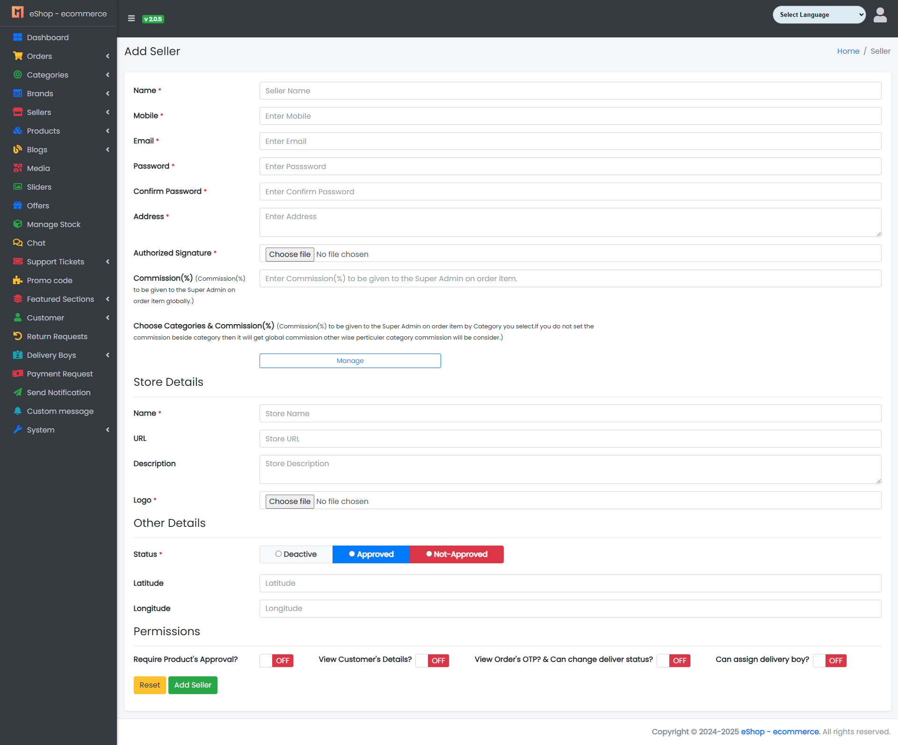

## Seller Panel

Sample image

Here all the information related to Sellers are displayed.

### Actions

- **Search Seller details**
  - 
    To search the Seller detail.
- **Refresh Seller list**
  - 
    To refresh Seller list.
- **Filters**
  - 
    Used to filter the Seller details according to the criteria.
- **Delete Seller Permanently**
  - 
    To delete the Seller.
- **Remove Seller (Trash)**
  - 
    To remove the Seller (move to trash).

---

### Add Seller

#### Adding New Seller to the Seller List

- Clicking the New Seller tab will open a new window as shown below:

Sample image

Steps:
1. In **Seller Name** field, enter the name of the Seller.
2. In **Seller Description** field, enter the description of the Seller.
3. In **Seller Email** field, enter the email of the Seller.
4. In **Seller Password** field, enter the password for the Seller.
5. In **Seller Address** field, enter the address of the Seller.
6. In **Seller Address Proof** field, enter the address proof of the Seller.
7. In **Seller Categories Wise Commission** field, enter the categories wise commission of the Seller.
8. In **Seller Commission** field, enter the commission of the Seller (for global commission).
9. In **Name of Store** field, enter the name of the Seller's store.
10. In **URL of Store** field, enter the URL of the Seller's store.
11. In **Description** field, enter the Seller description.
12. Click **Add Seller** to add the Seller, or **Reset** to reset the form.