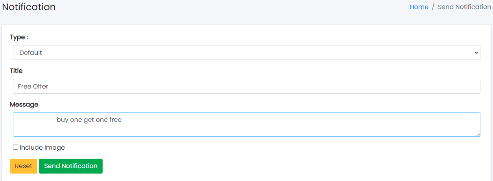

# Send Notification

Sample image

Here all the information related to Notification Details is displayed.

---

#### Actions

- **Search Notification Details**
  - 
    To search the Notification Title or any other detail.
- **Refresh Notification list**
  - 
    To refresh Notification List.
- **Filters**
  - 
    Used to filter the Notification details according to the criteria.
- **Delete Notification**
  - 
    Used to delete the Notification details.

---

We can send notifications and delete notifications by following steps:

---

## Step 1: Fill the Fields as Follows

Sample image

Steps:
1. Select **Type** of the Notification.
2. In **Title** field, enter the title of the Notification.
3. In **Message** field, enter the message of the Notification.
4. In **Image** field, select the image.
5. Click **Send Notification** to send the notification or **Reset** to reset the form.

---

## Step 2: Delete Notification from the List

For deleting Notification, use  as explained above under Actions Notification.