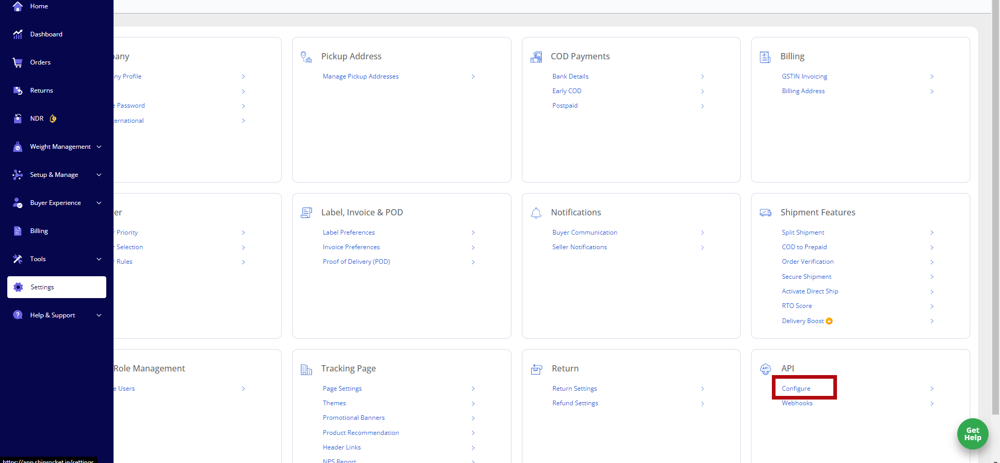
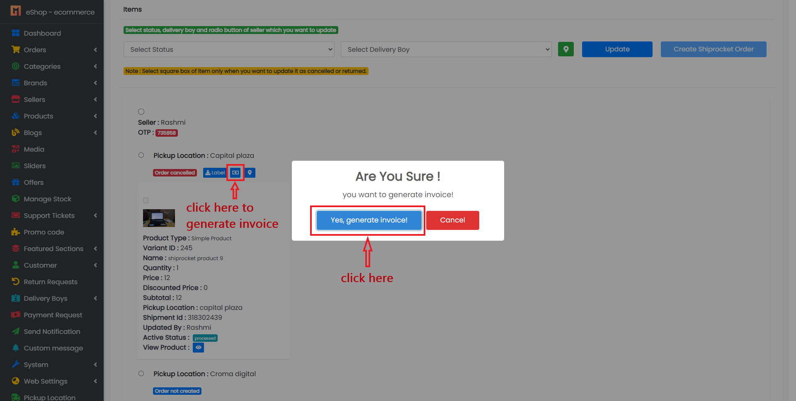
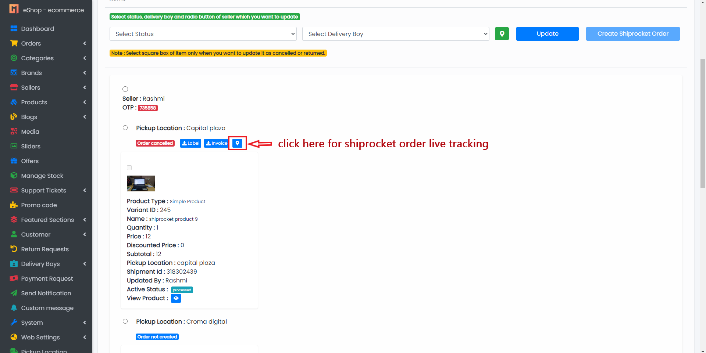

# Shipping Methods

- **In Shipping, you can select shipping methods for delivering orders to customers.**
- **Currently, 2 shipping methods are available in eShop. You can use both shipping methods at the same time.**

## Type:

1. **Local Shipping**
2. **Standard Shipping**
   - Shiprocket

### How to Change Shipping Methods

---

## Local Shipping Method

- In this method, you can assign your delivery boy to deliver customer orders.

---

## Standard Shipping

- In this method, you can use other courier services like Shiprocket to deliver orders to customers.

#### Shiprocket

Shiprocket, a product of Delhi-based BigFoot Retail Solution, is India's first automated shipping software that aims to reduce ecommerce shipping to its bare bones. You can print bulk shipping labels and ship your products to destinations in and around the world using a single platform.

---

## Account

- First, create a Shiprocket account. [Click here](https://app.shiprocket.in/register).

---

## Recharge Wallet

- After successfully logging in, you need to recharge your Shiprocket wallet. Without a wallet balance, you cannot use Shiprocket's services.

---

## API Config

- To use Shiprocket in your system, first go to API Config from [here](https://app.shiprocket.in/api-user).

- Create a user to use Shiprocket in your system.

- After creating the user, add the user credentials in your admin panel.

---

## How It Will Work?

### 1. Add Pickup Location

- Shiprocket uses a pickup location to pick up orders from the owner.
- In your system, only the seller can add a pickup location. Sellers can add pickup locations from their panel.

After adding the pickup location, the admin must verify the pickup location from both the admin panel and the Shiprocket dashboard.

1. **Verify pickup location from admin panel:**
   
2. **Verify pickup location from Shiprocket dashboard:**
   
   

---

### 2. Add Product or Edit Product

- After successfully verifying the pickup location, you can add or edit products.

  - **For simple product:**  
    

  - **For variable product:**  
    

---

## How to Create Shiprocket Order?

- After receiving orders and if you want to deliver an order using Shiprocket, you have to create a Shiprocket order. Go to "Edit Order" in your panel.

1. **Select Pickup Location** for which you want to create a parcel and click on "Create Shiprocket Order" button.  
   
2. **Generate AWB Code** (a unique number used to identify the order).  
   
3. **Send Pickup Request** to schedule your shipping.  
   
4. **Generate and Download Label.**  
   
   
5. **Generate and Download Invoice.**  
   
   
6. **Cancel Shiprocket Order.**  
   
7. **Shiprocket Order Tracking.**  
   