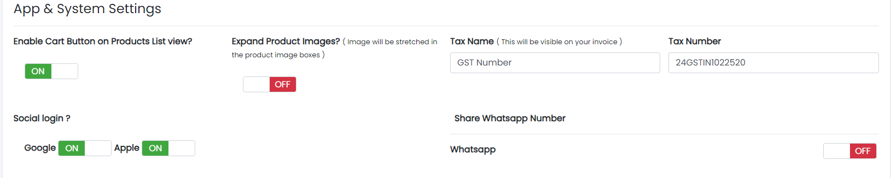
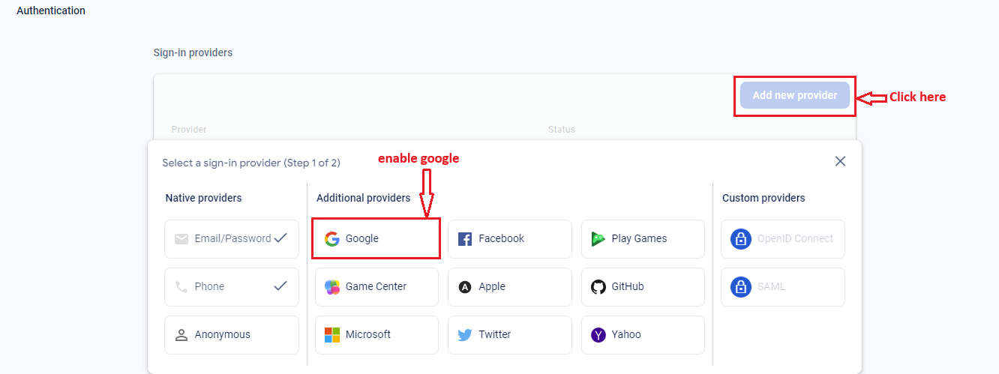

# Configure the Firebase Setup for Social Login (Web Version)

To enable social login (e.g., Google) for your eShop web version, follow these steps:

## 1. Enable Social Login in Admin Panel

- Go to **System → Store Settings** in your Admin Panel.
- Turn **ON** the social login method(s) you want to enable.

_Sample image_

---

## 2. Enable Social Sign-In Method in Firebase

- Open your Firebase project.
- Go to **Authentication** and open the **"Sign-in method"** tab.

_Sample image_

- Enable **Google sign-in method** (and any other providers you require).

---

You have now configured Firebase for social login on your web version!