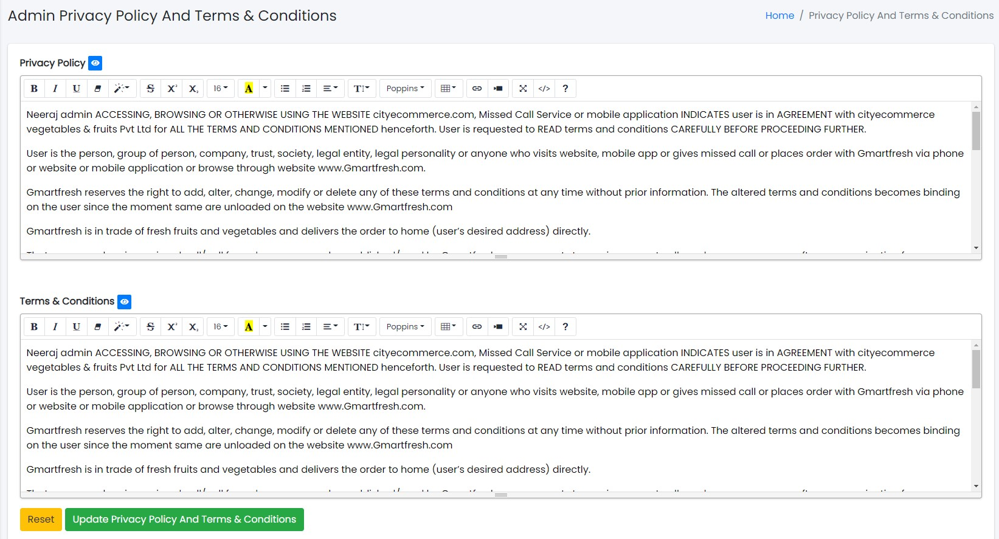

### Admin Privacy Policy

- The System Tab contains a sub-tab named Admin Privacy Policy.

Sample image

---

- From here, the Admin privacy policy and terms and conditions can be updated as per requirements.
- Click Update Privacy Policy And Terms & Conditions button to update information or Reset to reset the form.
