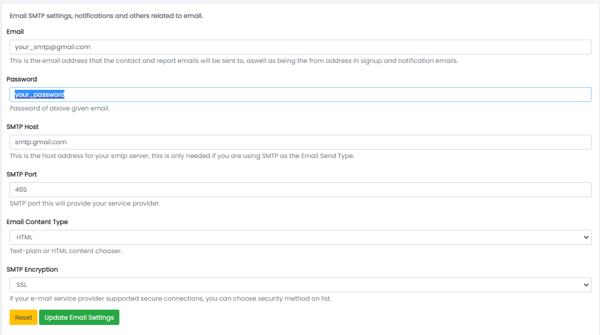
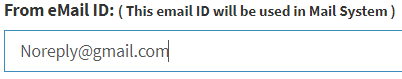

### Email Setting

- The System Tab contains a sub-tab named Email Settings.

Sample image

---

- From here, the Email Settings can be updated as per requirements:
    - From Email ID:  
      
      All emails in the system will be sent from this email ID.
    - Password: Update the password for the email account.
    - SMTP Host: Update the SMTP host.
    - SMTP Port: Update the SMTP port.
    - Email Content Type: Update the email content type.
    - SMTP Encryption: Update the SMTP encryption.
    - Click Update Email Settings to update Email Settings or Reset to reset the form.
    