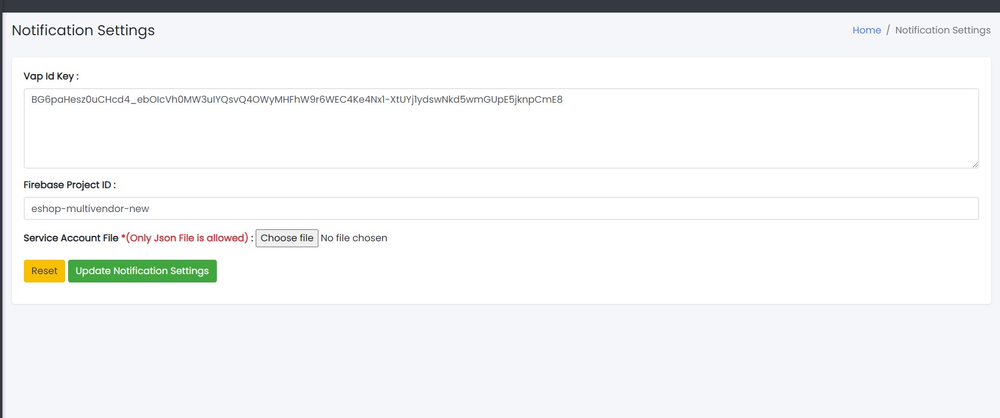
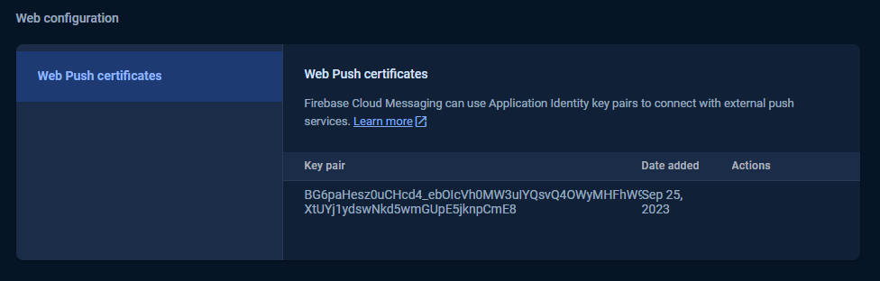
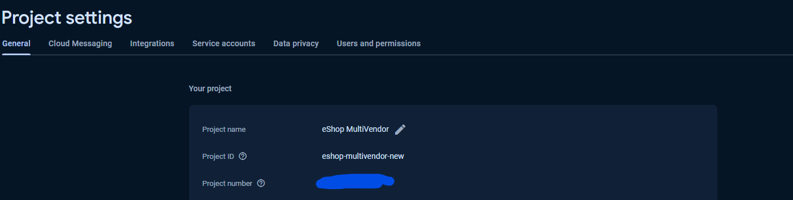
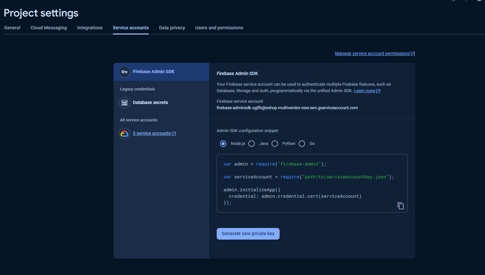

### Notification Settings

- The System Tab contains a sub-tab named Notification Settings.

Sample image

---

- Vap id:  
  Firebase → Project Settings → Cloud Messaging → Web Configuration → here you have to generate it  
  

- Firebase Project ID:  
  Firebase → Project Settings → General → Project ID  
  

- Service Account File:  
  Firebase → Project Settings → Service Account → Generate new private key → Here you will get a JSON file which you need to upload in the admin panel  
  

---

- Click the button to update notification settings or Reset to reset the form.
