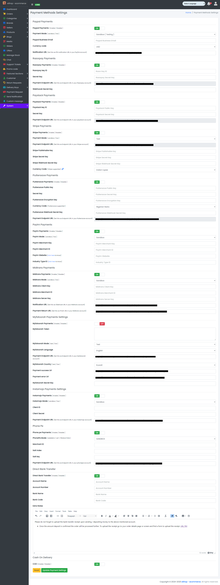

### Payment Methods

- The System Tab contains a sub-tab named Payment Methods.

Sample image

---

- From here, the Payment Methods can be updated as per requirements:

#### Paypal Payments
  - Paypal Payments: Update the Paypal Payments.
  - Payment Mode: Update the Payment Mode.
  - Paypal Business Email:  
    
    Update the Paypal Business Email.
  - Currency code: Update the Currency code.
  - Notification URL: Update the Notification URL.

#### Razorpay Payments
  - Razorpay Payments: Update the Razorpay Payments.
  - Razorpay key ID: Update the Razorpay key ID.
  - Secret Key: Update the Secret Key.
  - Webhook Secret Key: Update the Webhook Secret Key.

#### Paystack Payments
  - Paystack Payments: Update the Paystack Payments.
  - Paystack key ID: Update the Paystack key ID.
  - Secret Key: Update the Secret Key.

#### Stripe Payments
  - Stripe Payments: Update the Stripe Payments.
  - Payment Mode: Update the Payment Mode.
  - Stripe Publishable key ID: Update the Stripe Publishable key ID.
  - Stripe Secret Key: Update the Stripe Secret Key.
  - Stripe Webhook Secret Key: Update the Stripe Webhook Secret Key.
  - Currency code: Update the Currency code.

#### Flutterwave Payments
  - Flutterwave Payments: Update the Flutterwave Payments.
  - Flutterwave Public key ID: Update the Flutterwave Public key ID.
  - Secret Key: Update the Secret Key.
  - Flutterwave Encryption key: Update the Flutterwave Encryption key.

#### Paytm Payments
  - Paytm Payments: Update the Paytm Payments.
  - Paytm Marchant key: Update the Paytm Marchant key.
  - Paytm Marchant ID: Update the Paytm Marchant ID.
  - Paytm Website: Update the Paytm Website.
  - Industry type ID: Update the Industry type ID.

#### Midtrans Payments
  - Midtrans Payments: Update the Midtrans Payments.
  - Payment Mode: Update the Payment Mode.
  - Midtrans Client Key: Update the Midtrans Client Key.
  - Midtrans Merchant ID: Update the Midtrans Merchant ID.
  - Midtrans Secret Key: Update the Midtrans Secret Key.
  - Currency code: Update the Currency code.

#### MyFatoorah Payments
  - MyFatoorah Payments: Update the MyFatoorah Payments.
  - MyFatoorah Token: Update the MyFatoorah Token.
  - MyFatoorah Mode: Update the MyFatoorah Mode.
  - MyFatoorah Language: Update the MyFatoorah Language.
  - MyFatoorah Secret Key: Update the MyFatoorah Secret Key.
  - Currency code: Update the Currency code.

#### Instamojo Payments
  - Instamojo Payments: Update the Instamojo Payments.
  - Payment Mode: Update the Payment Mode.
  - Instamojo Client ID: Update the Instamojo Client ID.
  - Instamojo Secret ID: Update the Instamojo Secret ID.

#### PhonePe Payments
  - PhonePe Payments: Update the PhonePe Payments.
  - Payment Mode: Update the Payment Mode.
  - PhonePe Marchant ID: Update the PhonePe Marchant ID.
  - PhonePe Client Key: Update the PhonePe Client Key.
  - PhonePe Client Secret: Update the PhonePe Client Secret.

#### Cash On Delivery (COD)
  - COD: Update the COD.

#### Direct Bank Transfer
  - Direct Bank Transfer: Update the Direct Bank Transfer settings.
  - Account Name: Set admin account name for bank transfer.
  - Account Number: Set admin account number for bank transfer.
  - Bank Name: Set admin bank name for bank transfer.
  - Bank Code: Set admin bank code for bank transfer.

---

- Click Update Payment Settings to update Payment Settings or Reset to reset the form.
