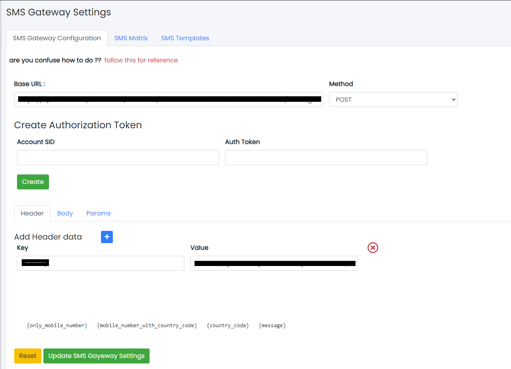
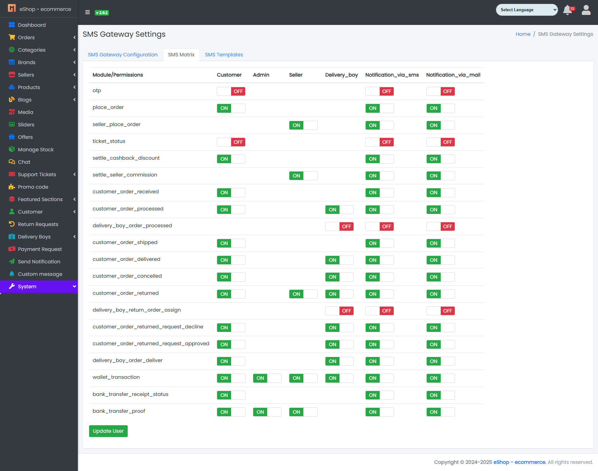
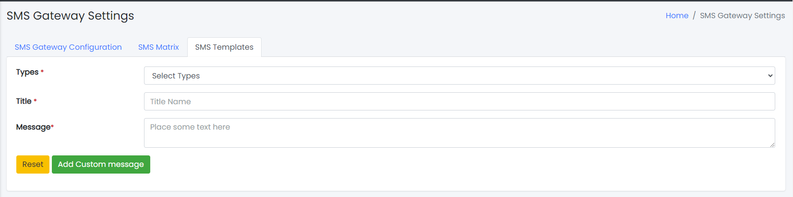

### SMS Gateway Settings

- The System Tab contains a sub-tab named SMS Gateway Settings.

Sample image

- SMS Gateway Configuration: From here you can set your custom gateway setting.
  

Sample image

- SMS Matrix: From here you can set notification send settings (e.g., if you don't want to send notifications via SMS, then turn it off).
  

Sample image

- SMS Template: From here you can set the SMS template.
