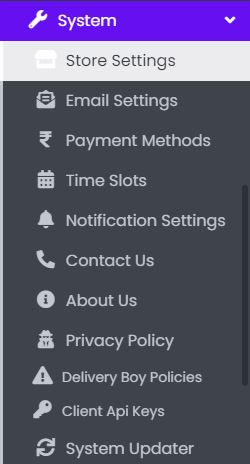
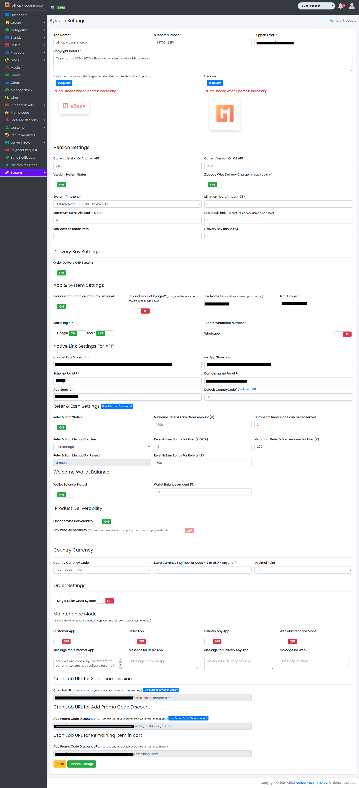

### System Panel

- The System Tab contains sub-tabs like Store Settings, Email Settings, Payment Methods, Time Slots, Notification Settings, Contact Us, Privacy Policy, Delivery Boy Privacy Policy, and About Us.

Sample image

---

### Store Setting

- The System Tab contains a sub-tab named Store Settings.

Sample image

---

- From here, the Store Settings can be updated as per requirements:
    - App Name: Update the App name.
    - Support Number: Update the Support Number.
    - Support Email: Update the Support Email.
    - Copyright Details: Update the Copyright details.
    - Logo: Update the App Logo.
    - Favicon: Update the App Favicon.
    - To know how to upload image in the form, click [here](#add-image-form).
    - Current Version Of App: Update the Current Version of the App.
    - Minimum Version Required: Update the Minimum Version.
    - Version System Status: Update the Version System Status.
    - Zipcode wise delivery charge: Set the Zipcode-wise delivery charge on or off.
    - Store Currency (Symbol or Code - $ or USD - Anyone): Update the Store Currency.
    - Delivery Charge Amount (₹): Update the Delivery Charge Amount (₹).
    - Minimum Amount for Free Delivery (₹): Update the Minimum Amount for Free Delivery (₹).
    - System Timezone: Update the System Timezone.
    - Minimum Cart Amount(₹): Update the Minimum Cart Amount(₹).
    - Maximum Items Allowed In Cart: Update the Maximum Items Allowed in Cart.
    - Minimum Order Amount (₹): Update the Minimum Order Amount (₹).
    - Order Delivery OTP System: Set OTP-based delivery.
    - Click Update Settings to update System Settings or Reset to reset the form.

---

#### **ONLY FOR APP**

  - Android Play Store Link: Set Android Play Store link.
  - IOS App Store Link: Set iOS App Store link.
  - Scheme For APP: Set Scheme for app.
  - Domain Name for APP: Set domain name for app.
  - APP Store ID: Set app store ID.
  - Default CountryCode: Set default country code.
