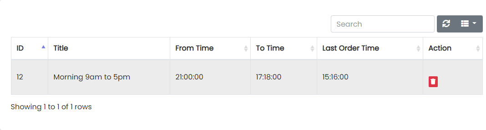

# Time Slots

Sample image

Here all the information related to Time Slots Details is displayed.

---

### Actions

- **Search Time Slots Details**
  - 
    To search the Time Slots Title or any other detail.
- **Refresh Time Slots list**
  - 
    To refresh Time Slots list.
- **Filters**
  - 
    Used to filter the Time Slots details according to the criteria.
- **Delete Time Slots**
  - 
    Used to delete the Time Slots details.

---

We can add Time Slots and delete Time Slots by following steps:

---

## Step 1: Fill the Fields as follows

Sample image

1. In Title field, enter the title of the Time Slots.
2. Select From Time of the Time Slots.
3. Select To Time of the Time Slots.
4. Select Last Order Time of the Time Slots.
5. Select Status of the Time Slots.
6. Click Add Time Slots to add to the Time Slots table or Reset to reset the form.

---

## Step 2: Delete Time Slots from the List

For deleting Time Slots, use  as explained above under Actions Time Slots.
