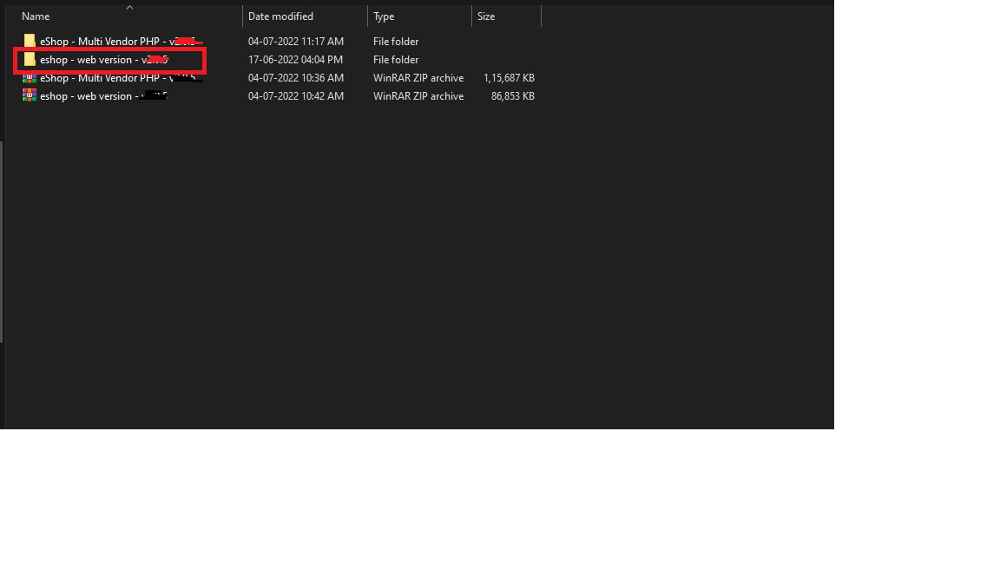
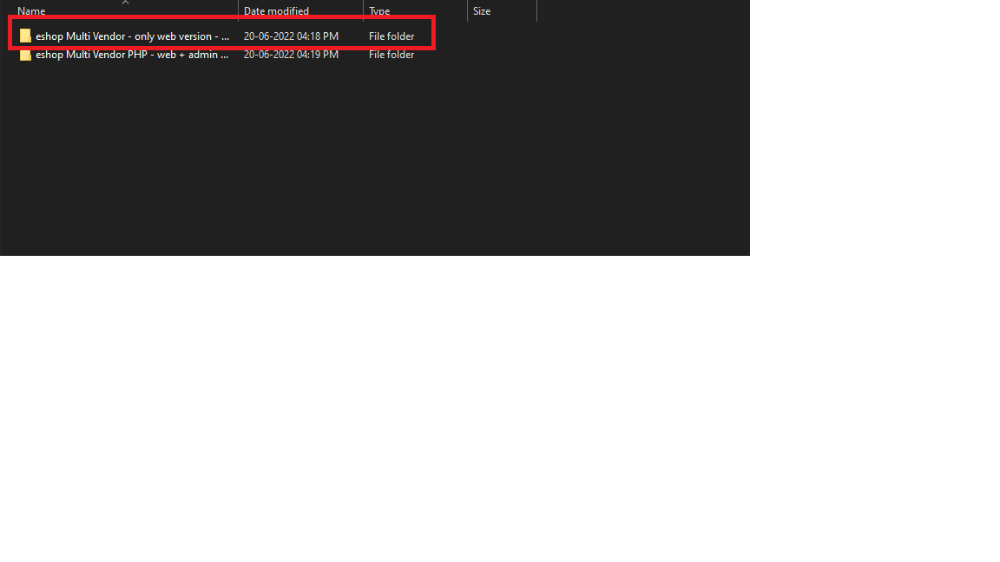

### How to Install the eShop Web if You Already Have the Admin Panel Installed

1. **Find the Web Version Installer**  
   Locate the **web version - vx.x.x - installer - updater** file from your downloaded PHP source code.
   
   
   
   

2. **Access the Updater Folder**  
   You can find the installer file in the folder mentioned above.

3. **Open the Updater in Your Browser**  
   Visit:  
   ```
   http://vendor.eshopweb.store/admin/updater
   ```

4. **Upload the Installer File**  
   Drag and drop the above-mentioned file into the updater and click the **"Update The System"** button.

5. **Upload update.zip**  
   Upload the **update.zip** file.

6. **Start the Update**  
   Click on the Update button.

7. **Success**  
   That's all. You have successfully installed the web version into your current system.