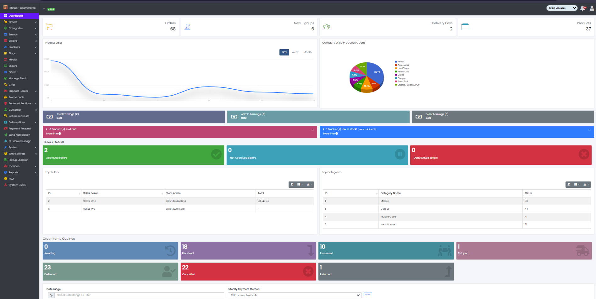
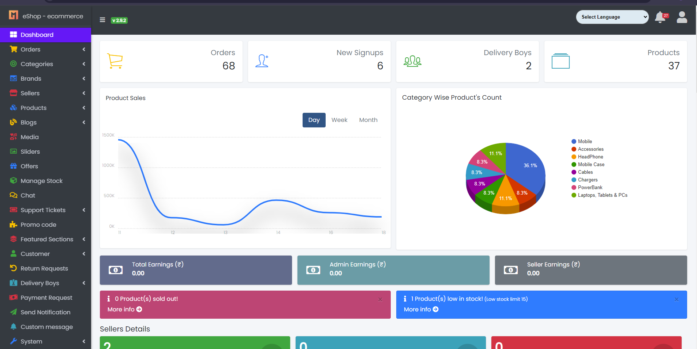
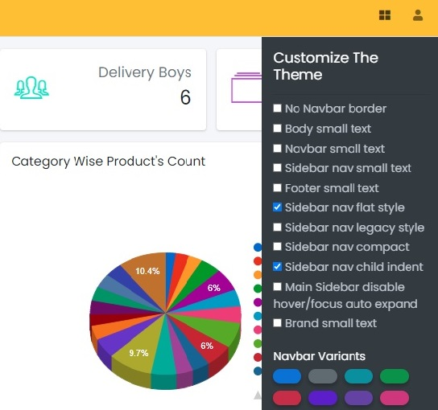
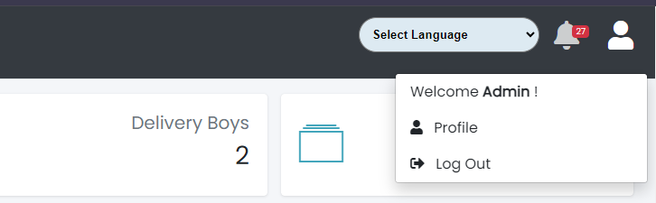

## Website Overview

Sample image

The above web page contains tabs on the left panel such as Home, Orders, Categories, Product, Home Slider Images, New Offers Images, Promo code, Featured Sections, Customer, Return Requests, Delivery Boys, Send Notification, System, Location, Reports, and FAQs to manage the whole website.

---

### Home Panel

Sample image

**The Home panel mainly contains 4 items:**

- **Orders:** To view Orders Information
- **New Signups:** To view New Signups Information
- **Delivery Boys:** To view Delivery Boys Information
- **Products:** To view Product Information

**And two charts:**

- **Products Sales:** To summarize sales in the last days, weeks, and months
- **Category Wise Product:** To summarize category wise product count

---

Sample image

The above web page contains a "Customize The Theme" panel on the right, with options like No Navbar Border, Body Small Text, Navbar Small Text, Sidebar Nav Small Text, Footer Small Text, Sidebar Nav Flat Style, Sidebar Nav Child Indent, Navbar Variants, Dark Sidebar Variants, to manage the look and feel of the website.

---

Sample image

**This section mainly contains 2 items:**

- **Profile:** To update the Admin information
- **Log Out:** Log out the admin panel